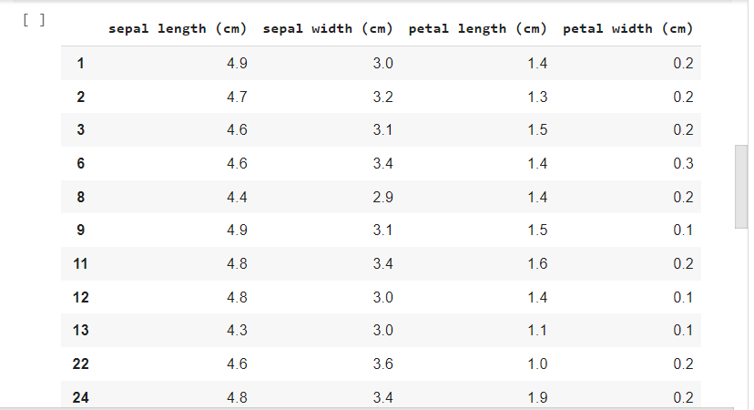

# Python-template
# This is my Mini project 9.
## I conducted analysis and data manipulation on the 'Iris' dataset which analyzes the various  biological features of flowers. 

#  I conducted the analyisis in an ipynb file in google colab, and moved it into my repo. The link to the cloud hosted notebook is available in my repository.
